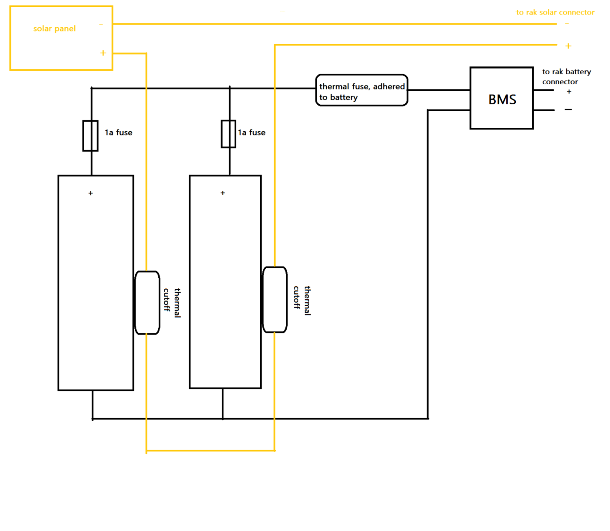

# Aurinkopaneeli Radio Tietoa

## Valmiit ja DIY Radiot

### Valmis Radio

- **WisBlock Meshtastic Starter Kit:** [Linkki tuotteeseen](https://store.rakwireless.com/products/wisblock-meshtastic-starter-kit?variant=43683420438726)
  - Tämä valmis radio on helppokäyttöinen ratkaisu, joka sisältää kaikki tarvittavat komponentit Meshtastic-verkkojen luomiseen ja hallintaan. Se on erityisesti suunniteltu helpottamaan aloitusta ja tarjoaa luotettavan suorituskyvyn ilman tarvetta lisärakennustöille.

### DIY Radio Materiaalit

- **Micro Controller:** [Linkki tuotteeseen](https://www.aliexpress.com/item/1005006271779544.html?spm=a2g0o.cart.0.0.794538daCS7oNX&mp=1)
  - Tämä mikrokontrolleri toimii radion aivoina, mahdollistaen laitteen ohjelmoinnin ja hallinnan.
- **LoRa Module:** [Linkki tuotteeseen](https://www.aliexpress.com/item/1005003087292795.html?spm=a2g0o.detail.0.0.7f94VDNPVDNPup&mp=1)
  - Tämä LoRa-moduuli tarjoaa pitkäkantaisen ja vähävirtaisen tiedonsiirron, joka on ihanteellinen Meshtastic-radion rakentamiseen.

## Tarvikkeet ja Linkit

### Aurinkopaneeli

- **Aurinkopaneeli (Max 5.5V):** [Linkki tuotteeseen](https://www.aliexpress.com/item/1005004689060279.html)
  - Tämä aurinkopaneeli soveltuu pienten elektronisten laitteiden, kuten radion, virtalähteeksi. Sen maksimijännite on 5.5V, mikä tekee siitä turvallisen ja tehokkaan ratkaisun aurinkovoimalla toimiville projekteille.

### Sulakkeet

- **Lämpösulake (80°C - 90°C thermal fuse):** [Linkki tuotteeseen](https://www.aliexpress.com/item/4000583221153.html)
  - Lämpösulake suojaa laitteistoa ylikuumenemiselta katkaisemalla virtapiirin, jos lämpötila ylittää turvallisen rajan.
- **Palautuva sulake (70°C - 75°C thermal cutoff):** [Linkki tuotteeseen](https://www.aliexpress.com/item/32893056909.html)
  - Palautuva sulake tarjoaa suojaa ylikuumenemiselta ja palautuu automaattisesti, kun lämpötila laskee turvalliselle tasolle.

### Tuuletusaukko

- **Hydrofobinen tuuletusaukko:** [Linkki tuotteeseen](https://www.aliexpress.com/item/1005006482403642.html)
  - Tuuletusaukko estää kosteuden pääsyn laitteistoon, mutta sallii ilman kiertämisen, mikä auttaa lämmönhallinnassa.

### Kuivaimet

- **Silika geeli pusseja:** [Linkki tuotteeseen](https://www.aliexpress.com/item/1005006191138911.html)
  - Silika geelipussit imevät kosteutta, mikä auttaa pitämään laitteiston kuivana ja estää kosteuden aiheuttamat vahingot.

### Suojat

- **Joka kennolle suoja (1s 1.5A):** [Linkki tuotteeseen](https://www.aliexpress.com/item/1005006767554992.html)
  - Kennokohtaiset suojat estävät yksittäisten kennojen ylikuormittumisen ja suojaavat niitä vaurioilta.

### Akkujen Pitimet

- **18650 pidin:** [Linkki tuotteeseen](https://www.aliexpress.com/item/1005004221055140.html)
  - 18650-akkukennot ovat yleisesti käytettyjä ja helposti saatavilla, ja näille kennoille tarkoitettu pidin helpottaa niiden turvallista käyttöä.
- **21700 pidin:** [Linkki tuotteeseen](https://www.aliexpress.com/item/1005003204083647.html)
  - 21700-akkukennot tarjoavat suuremman kapasiteetin ja virran, ja näille kennoille tarkoitettu pidin varmistaa niiden turvallisen ja tehokkaan käytön.

### Hitsaus

- **Piste hitsi:** [Linkki tuotteeseen](https://www.aliexpress.com/item/1005005928173134.html)
  - Pistehitsaus on suositeltava menetelmä akkujen yhdistämiseen, koska se minimoi akkujen vaurioitumisriskin ja varmistaa luotettavan liitoksen.

### Akut

- **21700 akku:** [Linkki tuotteeseen](https://akkula.fi/tuote/molicel-inr21700-p42a-li-ion-akkukenno-36v-4200-mah-30a-ei-suojapiiria-flat-top/)
  - Molicel INR21700 P42A on korkean suorituskyvyn litiumioniakku, joka tarjoaa suuren kapasiteetin (4200 mAh) ja korkean virranantokyvyn (30A).
- **18650 akku:** [Linkki tuotteeseen](https://akkula.fi/tuote/lg-hj2/)
  - LG HJ2 on luotettava 18650-akku, joka tarjoaa hyvän kapasiteetin (3000 mAh) ja vakaan suorituskyvyn.

## Akkujen Suojaus

Akkujen suojaus on tärkeää niiden turvallisen käytön varmistamiseksi. Tässä muutamia vinkkejä ja suosituksia akkujen suojaamiseen:

### Sulakkeiden Asennus

Sulakkeet ovat tärkeitä akkujen suojaamisessa ylikuormitukselta ja ylikuumenemiselta. Sulakkeiden asennus riippuu akkujen lukumäärästä ja niiden käyttötarkoituksesta.

- **Lämpösulake:** Lämpösulake tulisi asentaa jonnekin akun läheisyyteen varmistamaan, että se reagoi nopeasti, jos akku ylikuumenee. Asennuspaikan valinta voi vaihdella, mutta tärkeää on varmistaa, että sulake on helposti saatavilla ja että se voi nopeasti katkaista virran akusta ylikuumenemistilanteessa.

- **Palautuva sulake:** Palautuva sulake, tai termisen katkaisijan, määrä riippuu akkujen lukumäärästä ja niiden ympäristöstä. Yleinen suositus on asentaa yksi sulake jokaista kahden akun ryhmää kohti, varmistaen että akkuja ei ladata jos ne ovat liian kuumat.

Muista tarkistaa akkujen valmistajan suositukset ja noudattaa turvallisuusohjeita sulakkeiden asennuksessa ja käytössä.

## Ohjeet ja Suositukset

### Sulakkeiden Valinta

Sulakkeiden arvot riippuvat täysin käytetyistä akuista, ja arvot on hyvä tarkistaa akun tiedoista. Yleisesti ottaen, sulakkeen koko kannattaa valita hieman suuremmaksi kuin akun maksimi kapasiteetti, mutta ei liian suureksi. Sulake voi myös olla alle akun maksimin, jos halutaan lisäsuojaa.

### Akun Yhdistäminen

Akun liittämisessä on suositeltavaa välttää akkujen suoraa tinaamista toisiinsa. Sen sijaan kannattaa käyttää pistehitsausmenetelmää tai kennoille tarkoitettuja koteloita, joissa on kontaktit. Tämä vähentää riskiä vaurioittaa akkuja ja parantaa turvallisuutta.

### Akkujen Käsittely ja Ylläpito

- **Säilytys:** Akut tulee säilyttää kuivassa ja viileässä paikassa. Vältä suoraa auringonvaloa ja korkeita lämpötiloja.
- **Lataaminen:** Käytä vain akkuihin sopivia latureita. Vältä ylilatausta ja tarkkaile akun lämpötilaa latauksen aikana.
- **Käyttö:** Vältä akun täydellistä purkamista, sillä se voi lyhentää akun elinikää. Pidä akkujen jännitetaso hallinnassa säännöllisillä tarkastuksilla.

### Yhteenveto

Tässä dokumentissa on esitetty olennaisia tietoja ja suosituksia aurinkopaneelipohjaisen radion rakentamiseen liittyen. Linkitetyt tuotteet ja ohjeet auttavat varmistamaan laitteiston turvallisuuden ja tehokkuuden. On tärkeää noudattaa annettuja ohjeita ja valita komponentit huolellisesti projektin onnistumiseksi.

### Lisätietoja

[Meshtastic keskustelu](https://discord.com/channels/867578229534359593/970723761013800970/1241813046360408174)

Kuvassa mainitty [BMS](https://www.etsy.com/fi-en/listing/1609406536/mppt-solar-battery-charger-and-regulator)

Lisäkuvien avulla voit saada lisää tietoa ja selkeyttää projektin rakennetta ja komponenttien asettelua.
