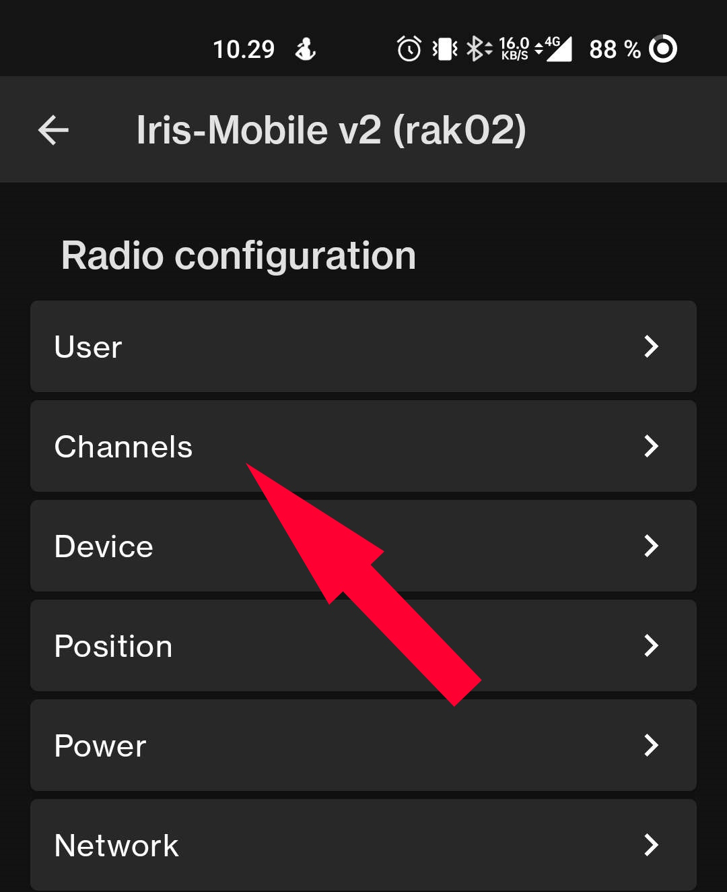

# Radio Channels <!-- {docsify-ignore-all} -->

In Finland, there are two official channels in use:

- **LongFast**: The encryption key is `AQ==`, which should be set by default.
- **Radio**: There is no encryption key, so remove the key that the application creates.

There is also an `admin` channel, which can remotely modify the settings of your radios if they are within radio range. **DO NOT SHARE** the encryption key of this channel under any circumstances!

## Creating a Channel

1. Go to the radio settings and find the section labeled `channels`. Click on it.

   
   
   

2. The channels will be loaded from the radio. Depending on the connection quality and the number of channels, this may take a moment.

   

3. Once the channels page has opened, you can create a new channel by clicking the green plus sign. LongFast is set by default, so it doesn't need to be created.

4. The location accuracy can be set according to your preference.

5. In LongFast, you don't need to enable uplink and downlink, as it is used for an MQTT network, which is not covered in this guide.

6. **DO NOT ENABLE** uplink and downlink for the Radio channel!

   
   
   

7. When you are ready, press `Save` to add the channel to the list. Finally, press the green `Send` button to send the channels to the radio.

   

8. A small window will open showing the progress of the transmission. Once the progress bar disappears, you can close the settings.

   
   

If you see the channels like this, congratulations! You have successfully created the channel(s).

