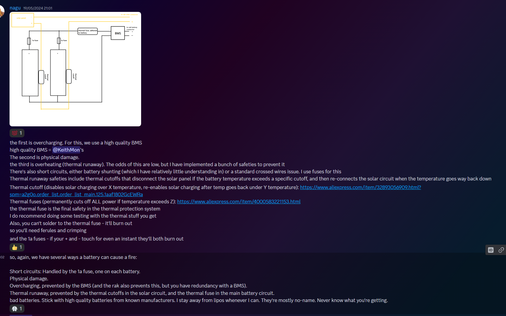
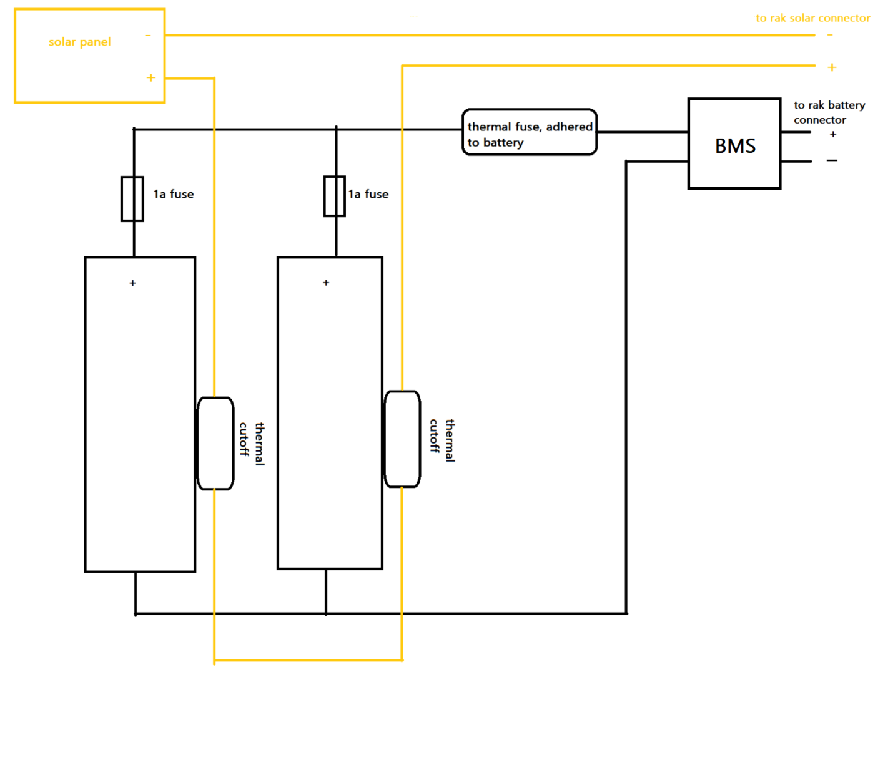

# Solar Panel Radio Information

## Ready-made and DIY Radios

### Ready-made Radio

- **WisBlock Meshtastic Starter Kit:** [Product Link](https://store.rakwireless.com/products/wisblock-meshtastic-starter-kit?variant=43683420438726)
  - This ready-made radio is an easy-to-use solution that includes all the necessary components for creating and managing Meshtastic networks. It is specifically designed to simplify setup and offers reliable performance without the need for additional construction.

### DIY Radio Materials

- **Micro Controller:** [Product Link](https://www.aliexpress.com/item/1005006271779544.html?spm=a2g0o.cart.0.0.794538daCS7oNX&mp=1)
  - This microcontroller acts as the brain of the radio, enabling device programming and management.
- **LoRa Module:** [Product Link](https://www.aliexpress.com/item/1005003087292795.html?spm=a2g0o.detail.0.0.7f94VDNPVDNPup&mp=1)
  - This LoRa module provides long-range and low-power data transmission, ideal for building Meshtastic radios.

## Accessories and Links

### Solar Panel

- **Solar Panel (Max 5.5V):** [Product Link](https://www.aliexpress.com/item/1005004689060279.html)
  - This solar panel is suitable for powering small electronic devices, such as radios. Its maximum voltage is 5.5V, making it a safe and efficient solution for solar-powered projects.

### Fuses

- **Thermal Fuse (80°C - 90°C thermal fuse):** [Product Link](https://www.aliexpress.com/item/4000583221153.html)
  - The thermal fuse protects the hardware from overheating by interrupting the circuit if the temperature exceeds a safe limit.
- **Resettable Fuse (70°C - 75°C thermal cutoff):** [Product Link](https://www.aliexpress.com/item/32893056909.html)
  - The resettable fuse provides protection against overheating and automatically resets when the temperature returns to a safe level.

### Ventilation Port

- **Hydrophobic Ventilation Port:** [Product Link](https://www.aliexpress.com/item/1005006482403642.html)
  - The ventilation port prevents moisture from entering the hardware while allowing air circulation, aiding in heat management.

### Desiccants

- **Silica Gel Packs:** [Product Link](https://www.aliexpress.com/item/1005006191138911.html)
  - Silica gel packs absorb moisture, helping to keep the equipment dry and prevent damage from moisture.

### Protectors

- **Cell Protection (1s 1.5A):** [Product Link](https://www.aliexpress.com/item/1005006767554992.html)
  - Cell-specific protectors prevent individual cells from overloading and protect them from damage.

### Battery Holders

- **18650 Holder:** [Product Link](https://www.aliexpress.com/item/1005004221055140.html)
  - 18650 battery cells are commonly used and easily available, and a holder designed for these cells facilitates their safe use.
- **21700 Holder:** [Product Link](https://www.aliexpress.com/item/1005003204083647.html)
  - 21700 battery cells offer higher capacity and power, and a holder designed for these cells ensures their safe and efficient use.

### Welding

- **Spot Welder:** [Product Link](https://www.aliexpress.com/item/1005005928173134.html)
  - Spot welding is a recommended method for connecting batteries, as it minimizes the risk of battery damage and ensures a reliable connection.

### Batteries

- **21700 Battery:** [Product Link](https://akkula.fi/tuote/molicel-inr21700-p42a-li-ion-akkukenno-36v-4200-mah-30a-ei-suojapiiria-flat-top/)
  - The Molicel INR21700 P42A is a high-performance lithium-ion battery that offers high capacity (4200 mAh) and high current capability (30A).
- **18650 Battery:** [Product Link](https://akkula.fi/tuote/lg-hj2/)
  - The LG HJ2 is a reliable 18650 battery that offers good capacity (3000 mAh) and stable performance.

## Battery Protection

Battery protection is important to ensure their safe use. Here are some tips and recommendations for battery protection:

### Fuse Installation

Fuses are important for protecting batteries from overload and overheating. The installation of fuses depends on the number of batteries and their intended use.

- **Thermal Fuse:** A thermal fuse should be installed somewhere near the battery to ensure that it reacts quickly if the battery overheats. The choice of installation location may vary, but it is important to ensure that the fuse is easily accessible and can quickly cut off the power from the battery in case of overheating.

- **Resettable Fuse:** The number of resettable fuses, or thermal cutoffs, depends on the number of batteries and their environment. A common recommendation is to install one fuse for every two battery groups, ensuring that batteries are not charged if they are too hot.

Remember to check the manufacturer's recommendations for batteries and follow safety instructions for fuse installation and use.

## Instructions and Recommendations

### Fuse Selection

The values of fuses depend entirely on the batteries used, and the values should be checked from the battery specifications. Generally, it is advisable to choose a fuse size slightly larger than the maximum capacity of the battery, but not too large. The fuse can also be smaller than the battery maximum if additional protection is desired.

### Battery Connection

It is recommended to avoid directly soldering batteries together. Instead, consider using spot welding or battery holders designed for cells with contacts. This reduces the risk of damaging batteries and improves safety.

### Battery Handling and Maintenance

- **Storage:** Batteries should be stored in a dry and cool place. Avoid direct sunlight and high temperatures.
- **Charging:** Use only chargers suitable for the batteries. Avoid overcharging and monitor the battery temperature during charging.
- **Usage:** Avoid fully discharging the battery, as it can shorten the battery's lifespan. Keep an eye on the voltage level of batteries with regular checks.

### Summary

This document provides essential information and recommendations for building a solar panel-based radio. The linked products and instructions help ensure the safety and efficiency of the equipment. It is important to follow the provided instructions and carefully select components for the success of the project.

### Additional Information

[Meshtastic discussion](https://discord.com/channels/867578229534359593/970723761013800970/1241813046360408174)

Referenced BMS: [BMS](https://www.etsy.com/fi-en/listing/1609406536/mppt-solar-battery-charger-and-regulator)

Additional images provide more information and clarity on the project's structure and component layout.
