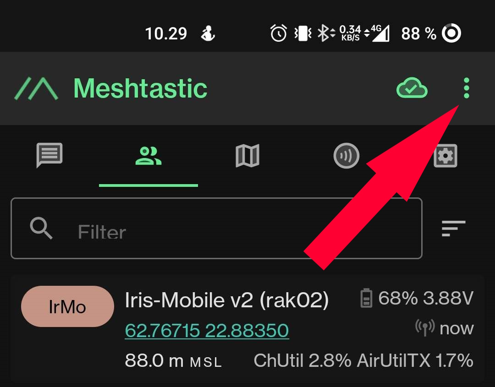
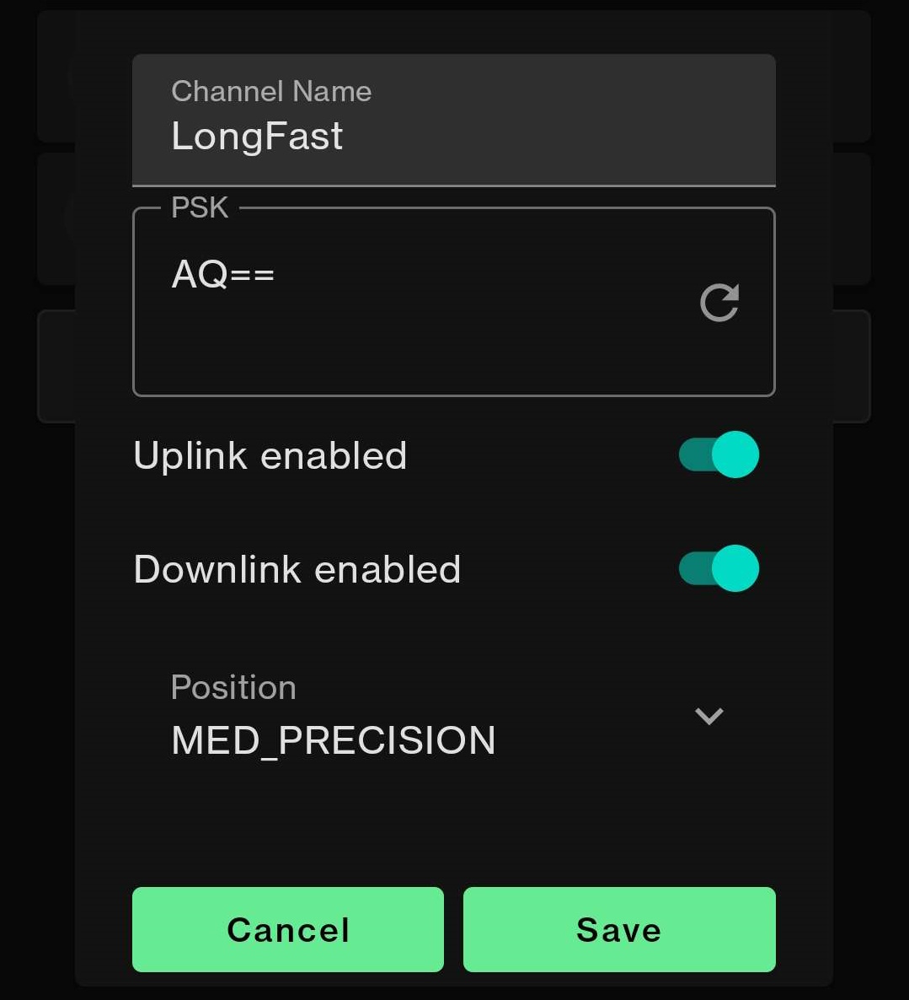
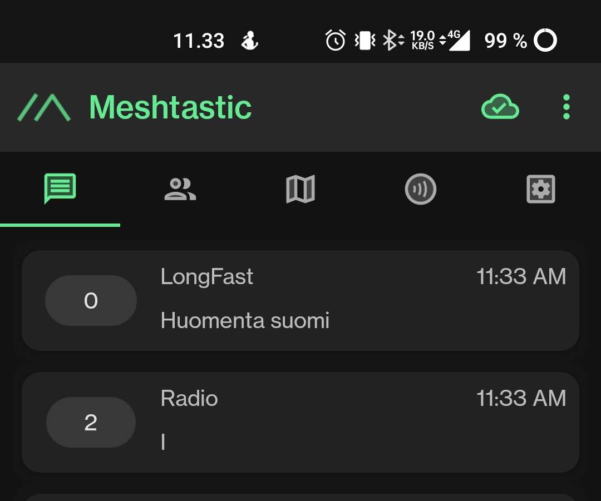

# Radion Kanavat

Suomessa on käytössä kaksi virallista kanavaa:

- **LongFast**: Salausavain on `AG==`, ja sen pitäisi olla oletuksena.
- **Radio**: Ei ole salausavainta, eli poista avain, jonka sovellus luo.

On olemassa myös `admin`-kanava, jolla voi etänä muokata omien radioiden asetuksia, jos on radioetäisyydellä. Kanavan salausavainta **EI SAA MISSÄÄN NIMESSÄ JAKAA!**

## Kanavan Luominen

1. Mene radion asetuksiin ja etsi kohta, jossa lukee `channels`. Paina siitä.

   
   
   

2. Kanavat ladataan radiosta. Riippuen yhteyden laadusta ja kanavien määrästä, tämä voi kestää hetken.

   

3. Kun kanavat-sivu on auennut, voit luoda uuden kanavan painamalla vihreää plussaa. LongFast on oletuksena, joten sitä ei tarvitse luoda.

4. Sijainnin tarkkuuden voi asettaa omien mieltymysten mukaan.

5. LongFastissa ei tarvitse laittaa uplink ja downlink päälle, sitä käytetään MQTT-verkossa, jota tässä ohjeessa ei käytetä.

6. Radio-kanavaan **EI SAA LAITTAA** uplink ja downlink päälle!

   
   
   

7. Kun olet valmis, paina `Save`, jotta kanava lisätään listaan. Lopuksi paina vihreää `Send`-nappia, niin kanavat lähetetään radiolle.

   

8. Näyttöön aukeaa pieni ikkuna, joka näyttää lähetyksen edistymisen. Kun palkki häviää, voit sulkea asetukset.

   
   

Jos näet kanavat näin, onnittelut! Onnistuit luomaan kanavan/kanavat.

---
